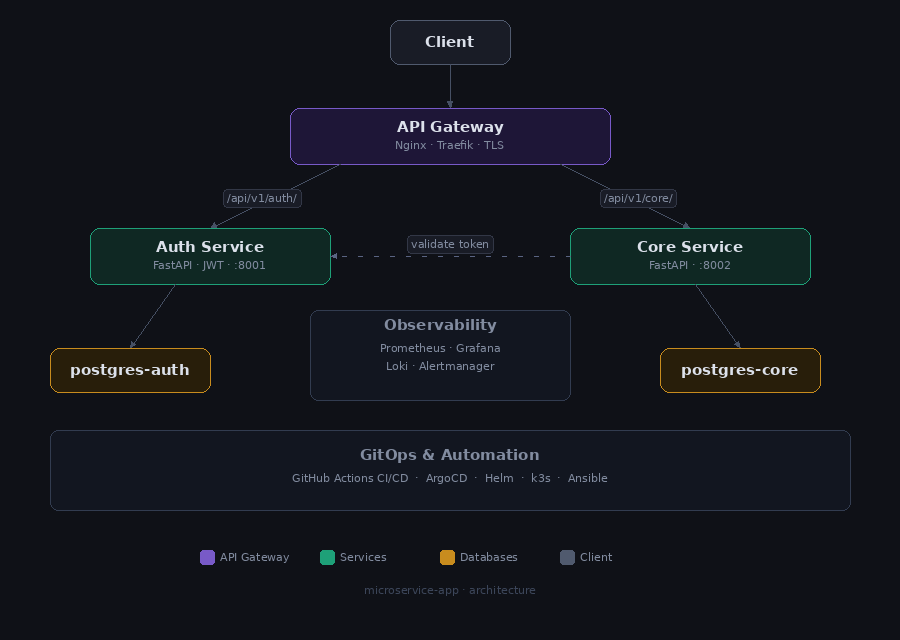

# Microservice App

## Overview

Microservice App is a production-oriented backend system designed with a strong emphasis on DevOps automation, reliability, and scalability.

The project implements a full CI/CD lifecycle, enabling automated testing, containerization, security scanning, and zero-downtime deployments with rollback capabilities. Services are deployed on Kubernetes (k3s) with Helm chart management and automated provisioning via Ansible.

---

## Architecture

The system follows a microservices architecture:

* **auth-service** — authentication and authorization (JWT)
* **core-service** — business logic layer
* **api-gateway** — Nginx-based reverse proxy
* **postgres** — relational database



### Key Design Decisions

* Single entry point via API Gateway
* Internal service communication over Kubernetes ClusterIP services
* Environment-driven configuration via Kubernetes Secrets and ConfigMaps
* Stateless services for scalability
* Helm-based deployment management

---

## Project Structure
```bash
microservice-app/
│
├── auth-service/
│   ├── app/
│   ├── alembic/
│   ├── helm/
│   ├── tests/
│   └── Dockerfile
│
├── core-service/
│   ├── app/
│   ├── alembic/
│   ├── helm/
│   └── Dockerfile
│
├── api-gateway/
│   ├── nginx.conf
│   ├── nginx.prod.conf
│   ├── Chart.yaml
│   ├── values.yaml
│   ├── values-production.yaml
│   └── values-staging.yaml
│
├── k8s/
│   └── base/
│       ├── api-gateway/
│       ├── auth-service/
│       └── core-service/
│
├── ansible/
│   ├── inventories/
│   ├── playbooks/
│   ├── roles/
│   └── ansible.cfg
│
├── monitoring/
│   ├── configs/
│   └── docker-compose.monitoring.yml
│
├── docker-compose.yml
└── .env
```

---

## Kubernetes Deployment (k3s)

Services are deployed on a lightweight Kubernetes cluster using k3s with Helm for package management.

### Stack

* **k3s** — lightweight Kubernetes distribution
* **Helm** — Kubernetes package manager
* **Traefik** — built-in ingress controller
* **Kubernetes Secrets** — sensitive configuration management
* **ConfigMaps** — non-sensitive configuration

### Deploy via Helm
```bash
# auth-service and core-service (via CI/CD)
helm upgrade --install auth-service ./auth-service \
  --namespace default \
  --values ./auth-service/values-production.yaml

# api-gateway (via Ansible)
ansible-playbook -i inventories/production/hosts.ini playbooks/helm.yml
```

### Reliability

* **Health Probes** — liveness, readiness and startup probes on all services
* **PodDisruptionBudget** — guaranteed availability during node maintenance
* **HPA** — horizontal autoscaling based on CPU/memory metrics
* **Resource limits** — CPU and memory requests/limits on all containers
* **RollingUpdate strategy** — zero-downtime deployments with `maxUnavailable: 0`

---

## Infrastructure Automation (Ansible)

The project includes a fully automated deployment system built with **Ansible**, enabling reproducible environments and consistent service rollout.

### Features

- Automated environment provisioning
- Docker & Docker Compose installation
- Helm installation and api-gateway deployment
- Template-based configuration generation
- Idempotent deployment
- Automated service rollout

### Directory Structure
```bash
ansible/
├── ansible.cfg
├── inventories/
│   ├── production/
│   │   └── group_vars/
│   ├── staging/
│   │   └── group_vars/
│   └── local/
│       └── group_vars/
├── playbooks/
│   ├── setup.yml
│   ├── deploy.yml
│   ├── rollback.yml
│   ├── monitoring.yml
│   └── helm.yml
└── roles/
    ├── setup/
    ├── deploy/
    ├── rollback/
    ├── monitoring/
    └── helm/
        ├── tasks/
        └── vars/

```

### Usage
```bash
# Setup all dependencies
ansible-playbook playbooks/setup.yml -K

# Deploy project to local server
ansible-playbook playbooks/deploy.yml -K

# Deploy monitoring stack
ansible-playbook -i inventories/local/hosts.ini playbooks/monitoring.yml -e "target=local" -K

# Install Helm and deploy api-gateway
ansible-playbook -i inventories/production/hosts.ini playbooks/helm.yml

# Rollback to previous image
ansible-playbook -i inventories/staging/hosts.ini playbooks/rollback.yml -e "service=core-service"
```

---

## CI/CD Pipeline

Implemented using GitHub Actions with a multi-stage pipeline.

### CI Pipeline

**Code Quality & Security**

* Ruff (linting & formatting)
* MyPy (static typing)
* Bandit (security analysis)

**Testing**

* pytest with async support
* multi-version testing (Python 3.11 / 3.12)

### Build & Delivery

* Docker image build using BuildKit
* Layer caching for faster builds
* Image tagging strategy:
  * `latest` for main branch
  * commit SHA for traceability

### Security

* Container scanning via Trivy
* Static code security analysis
* Secrets managed via GitHub Secrets and Kubernetes Secrets

---

## Continuous Deployment

### Staging Deployment

* Trigger: push to `main`
* Automated deployment via Helm
* Zero-downtime rolling update
* Database migrations executed automatically (Alembic)
* Healthcheck with retry strategy
* Automatic rollback on failure

### Production Deployment

* Trigger: git tags (`auth-v*`, `core-v*`)
* Same deployment strategy as staging
* Release creation in GitHub
* Telegram notifications for deployment status

### API Gateway Deployment

* Managed separately via Ansible
* Trigger: manual execution
* Helm-based deployment

---

## Reliability & Rollback Strategy

* Healthcheck-based deployment validation
* Retry mechanism for service readiness
* Automatic rollback to previous Docker image on failure
* Version traceability via image tags

---

## Testing Strategy

* Async API testing with httpx
* Endpoint-level validation:
  * authentication
  * registration
  * healthchecks

---

## Implemented

**Infrastructure**
* [x] Kubernetes deployment (k3s) + Helm chart management
* [x] Ansible automation (provisioning, deploy, rollback)
* [x] Docker & docker-compose orchestration
* [x] PostgreSQL integration + Alembic migrations

**CI/CD**
* [x] CI pipeline (lint, type-checking, tests, security scanning)
* [x] CD pipeline (staging & production, separate build pipelines)
* [x] Docker image build & push + GitHub Releases automation
* [x] Automated rollback strategy + Telegram notifications

**Reliability**
* [x] Health probes (liveness, readiness, startup)
* [x] Resource limits, HPA, PodDisruptionBudget
* [x] RollingUpdate strategy (zero-downtime)

**Security**
* [x] Container scanning (Trivy) + static analysis (Bandit)
* [x] JWT authentication

**Observability**
* [x] Prometheus + Grafana + centralized logging (loki)

---

## Roadmap

* [ ] Redis (caching, rate limiting)
* [ ] Canary deployments
* [ ] Terraform infrastructure provisioning

